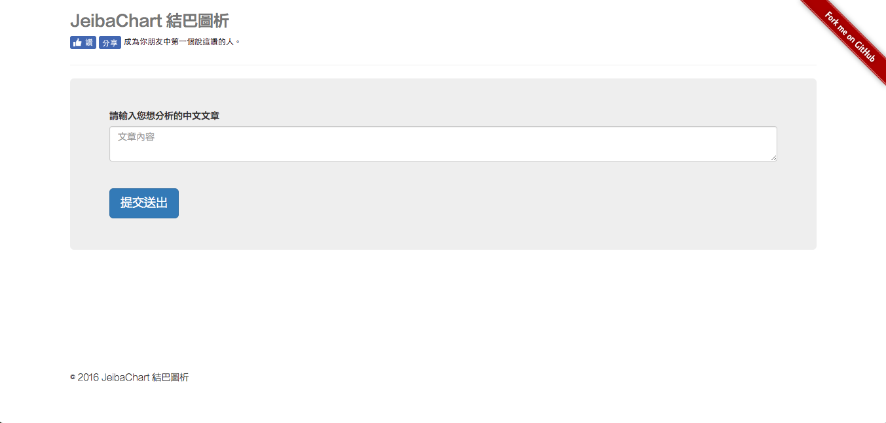
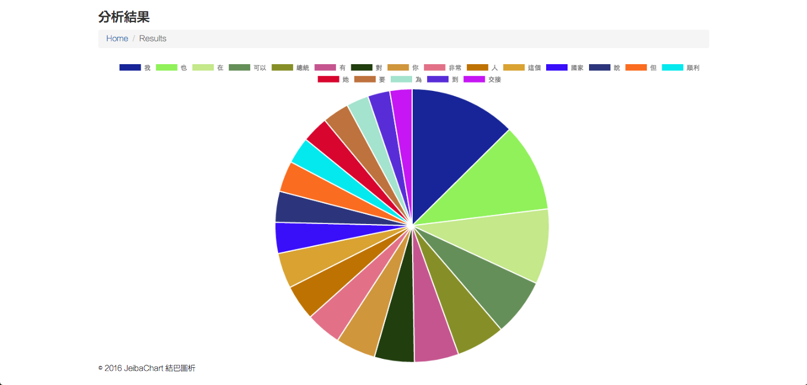

# JeibaChart 
A online Chinese text segmentation visualization tool based on Python / Flask /[Jeiba](https://github.com/fxsjy/jieba).




## Usage 

```
$ git clone https://github.com/kdchang/python-jieba-chart.git
```

```
$ cd python-jieba-chart
```

Setup virtualenv（Python3）

```
$ virtualenv -p python3 python-jieba-chart-venv
```

```
$ source/python-jieba-chart-venv/bin/activate
```

```
$ pip install requirements.txt
```

```
$ npm install && bower install
```

```
$ npm start
```

# License
MIT

# Documents
1. [Official Website](https://virtualenv.pypa.io/en/stable/)
